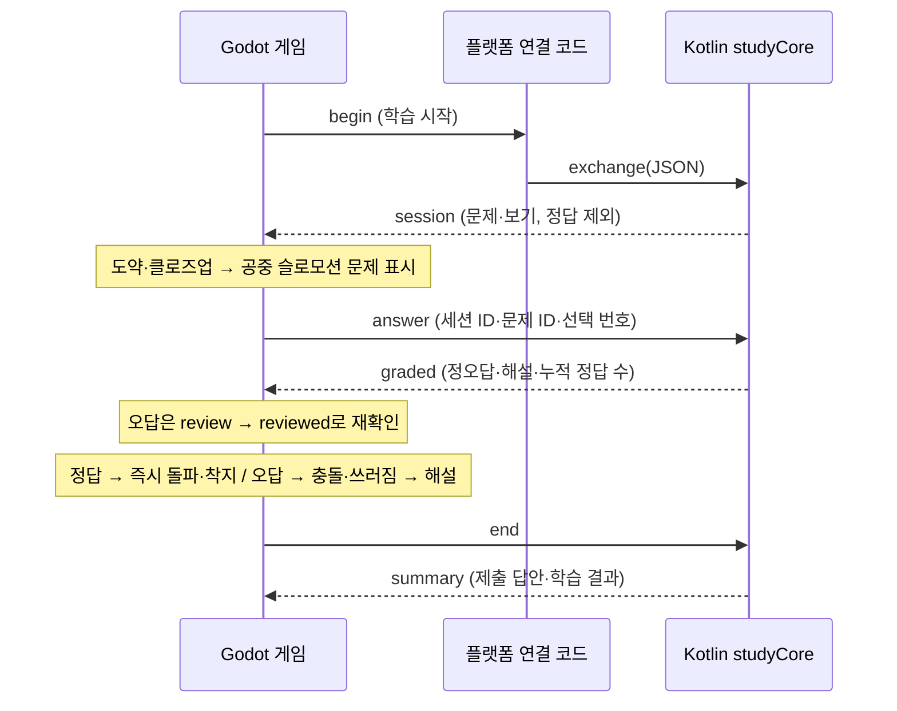

# Kotlin 학습 기능과 Godot 게임의 경계

앱의 기본 화면은 Kotlin/Compose 노트 서재다. 일반 마크다운은 게임 없이 읽고 편집한다. 문제 생성 프롬프트를 복사해 외부 AI에서 만든 JSON을 가져온 뒤, 문제 묶음에서 게임을 선택할 때 Godot을 초기화하고, 학습 화면에서는 게임 렌더링을 실행하지 않는다. `shared/study/StudyHome.kt`는 플랫폼 공통 학습 UI이며, 같은 모듈에 남은 이전 Canvas 러너는 새 앱의 실행 경로에 들어가지 않는다.

| 담당 | 소유하는 기능 | 의존하지 않는 것 |
|---|---|---|
| `shared` 학습 UI + Android `StudyHomeActivity` / iOS `NotebookHost` | 노트 서재·검색·마크다운 읽기·편집·저장·내보내기, 프롬프트 복사, 문제 파일 가져오기·미리보기, 학습 진입, 최근 결과 | Godot 초기화·렌더링 |
| `studyCore` — Kotlin Multiplatform | 노트와 문제 파일 검증, 프롬프트 구성, 문제 추출·보기 섞기, 정답 보관, 학습 세션, 채점, 해설, 결과 집계 | Godot, Compose, Android UI |
| `godot-runner` — GDScript | 월드·캐릭터·장애물·물리·입력·사운드, 문제 표시 시점, 선택지 표시, 채점 결과의 연출 | 문제 생성 규칙, 정답 판정 규칙 |
| Android `StudyBridgePlugin` | 선택한 문제 파일을 Kotlin 서비스에 전달, JSON 중계, 종료 결과 반환 | 학습·게임 규칙 |
| iOS `StudyPlatform` + `StudyEngine` | 시스템 파일·클립보드·창 연결, 게임 지연 초기화·표시·렌더링 중단, JSON 파일 중계 | 문서 검증·학습·게임 규칙 |



## 프로토콜 v1

모든 메시지는 UTF-8 JSON이며 `version`, `requestId`, `type`, `body`를 가진다.

Android·iOS의 `begin.body.questionSet`은 [문제 파일 v1](QUESTION_FILES.md)의 JSON 객체다. 호스트가 파일을 읽고 다시 검증해 주입한다. 현재 게임은 `begin.body.continuous: true`로 시작한다. Kotlin은 파일의 3~20문항 전체를 섞고, 각 문항의 보기 순서를 섞으면서 정답 위치를 보존한다. 한 회차를 마치면 다시 섞어 반복한다. 기존 클라이언트의 `continuous` 생략 시에는 3문항 세션을 유지한다. 잘못된 파일은 오류로 반환하며 예제 문제로 대체하지 않는다. 전체 요청은 120,000자, 문제 파일은 100,000자 이하이다.

데스크톱·기존 iOS 시제품과의 호환을 위해 `begin.body.notes`의 `용어: 설명` 생성기도 남아 있다. 서로 다른 개념 3~20개, 용어 60자·설명 300자·전체 12,000자까지 허용하며 중복·형식 오류를 거절한다. `questionSet`과 `notes`가 모두 없으면 예제 노트를 사용하는 기존 동작이다. **현재 Android·iOS 서재에서는 이 경로로 게임을 시작하지 않는다.** 노트에 `복습 개념` 영역을 요구하지 않는다.

`session.body`에는 `sessionId`, `title`, `continuous`, `questions[{id,prompt,choices}]`만 들어간다. `correctChoice`와 해설을 미리 보내지 않는다. 보기 번호는 **0, 1, 2**이다. Godot은 전달받은 순서를 유지한다.

```json
{"version":1,"requestId":"run-2","type":"answer","body":{"sessionId":"...","questionId":"q1","selectedChoice":1}}
```

`graded.body`: `sessionId`, `questionId`, `selectedChoice`, `correct`, `correctChoice`, `explanation`, `answeredCount`, `correctCount`.

```json
{"version":1,"requestId":"run-3","type":"end","body":{"sessionId":"..."}}
```

`summary.body`: `sessionId`, `answeredCount`, `questionCount`, `correctCount`, `reviewedCount`, `answers` (채점 응답 목록). 완주·실패·중도 종료에서 호출한다. Android·iOS는 서재로 복귀할 때 최근 결과 한 개를 저장한다. 제출하지 않은 문제는 오답으로 집계하지 않는다. Godot의 최고 거리·음소거 저장은 게임 설정이므로 Godot에 남긴다.

실패 응답은 `type: "error"`, `body.message`이다. 연결 실패 시 Godot은 달리기를 멈추고 오류와 처음 화면으로 돌아가는 동작을 제공한다. 임의로 채점하거나 학습을 건너뛰지 않는다.

## 문제 중심 관문 (2026-09-27)

게임 진입 후 1.25초간 관문 접근·도약을 연출하고 첫 문제를 표시한다. 학습 모드에서는 장애물·체력 손실·수동 이동을 사용하지 않는다. 정답이 확인되면 금빛 화면 효과, 에너지 흡수, 정답 사운드와 모바일 진동을 요청한다. 채점 직후 문제 카드를 숨기고 정답이면 몸이 닿는 순간 벽 파괴·통과·달리기 착지, 오답이면 충돌·넉백·쓰러짐을 1.1초간 보여 준다. 오답에만 해설을 표시하며 정답이면 멈추지 않고 자동으로 진행한다. 최초 정답 +10, 해설 후 올바른 재응답 +5를 얻는다. 에너지는 이번 세션의 보상이며 영구 재화가 아니다. 화면에는 거리·완주 분모 대신 완료한 관문 수를 표시한다. 정답으로 착지하면 버튼 입력 없이 1.2초 이동 후 다음 관문 접근·도약으로 이어진다. 세 관문 제한은 없으며 사용자가 학습 홈으로 돌아갈 때 종료·저장한다.

`next` 요청은 `sessionId`, `afterQuestionId`를 받는다. Kotlin이 완료된 회차를 확인하고 같은 세션에서 새 `questions` 묶음을 반환한다. 문제 ID는 반복 회차에서도 고유하고, 최초 답안·정답·재확인 누적 기록은 초기화하지 않는다. 전체 파일을 한 번씩 다룬 뒤 다시 섞으며, 회차 경계에서 같은 문제가 바로 이어지는 것을 피한다. 응답의 공개 필드는 `session`과 같고 정답은 포함하지 않는다. 같은 경계 요청의 재전송은 이미 준비한 묶음을 반환한다. `questionCount`는 준비된 문제 수, `answeredCount`는 실제 제출 수이므로 학습 결과는 제출 수를 기준으로 읽는다.

`review`는 `answer`와 같은 요청 필드를 사용하며 `reviewed`를 반환한다. 응답은 `graded` 필드와 `reviewedCount`를 포함한다. 가장 최근에 최초 오답을 제출한 문제만 재확인할 수 있다. Kotlin이 다시 채점하되 최초 `answers`, `answeredCount`, `correctCount`를 바꾸지 않는다. 올바르게 재확인한 문제 ID를 집합으로 기록하여 반복 요청으로 중복 집계하지 않는다. `end`와 새 세션 이후에는 재확인을 거절한다. 첫 답의 정답률과 해설을 본 뒤의 확인을 구분하며, 같은 문제의 즉시 재응답을 장기 암기 성공으로 간주하지 않는다.

## 호출·중복·생명주기

- 호스트는 Kotlin `StudyService` 하나에 순차적으로 호출한다. 서비스는 해당 게임 진입 동안 유지된다. iOS는 엔진을 재사용하지만 게임 진입마다 Kotlin 서비스를 새로 만든다.
- Kotlin은 현재 세션·현재 문제·보기 범위를 검증한다. 이전 세션과 이미 종료된 세션의 새로운 답안은 거절한다.
- 같은 문제에 같은 답을 재전송해도 집계하지 않는다. 제출한 답을 변경하는 요청은 거절한다.
- 같은 `requestId`와 동일한 요청은 이전 성공 응답을 돌려준다(최근 64개). 같은 ID에 다른 내용을 쓰면 오류다.
- Godot은 요청 중 중복 입력을 막고 응답의 버전·요청 ID·세션·문제·값 범위를 확인한다.
- 문제를 읽는 동안 코스의 누적 거리는 유지하되 캐릭터가 미세하게 전진·부유하고, 저속 궤적이 흐르며 카메라가 서서히 가까워진다. 문제 풀이 시간은 15초이며 시간 초과 시 미응답으로 채점하고 충돌 후 해설을 표시한다. 전역 Engine.time_scale을 바꾸지 않아 Kotlin 통신 타임아웃에 영향을 주지 않는다. 채점 직후 통과하면 자동으로 다음 관문으로 이어지고, 충돌한 경우에만 해설을 보여 준다. 오답은 쓰러진 상태에서 해설을 읽고 다시 일어나 같은 문제에 도전한다. 접근·통과·충돌 중 앱 전환은 해당 연출을 일시정지하고 복귀 후 이어간다.
- 앱 프로세스 종료 후에는 새 학습으로 시작한다. 기기에 저장한 노트와 최근 완료/중단 결과는 유지되지만, 진행 중 세션 복원과 전체 학습 이력은 미구현이다.

## Android 화면과 엔진 수명

`StudyHomeActivity`만 런처에 노출한다. 홈 프로세스에서는 Godot을 초기화하지 않는다.
`JadeRunActivity`는 외부 실행을 막고(`exported=false`), `:learning_game` 프로세스에서 실행한다. 공식 [Android 라이브러리 안내](https://docs.godotengine.org/en/stable/tutorials/platform/android/android_library.html)의 프로세스별 엔진 제한과 엔진 종료 수명을 고려했다.

1. 문제 모음에서 선택한 JSON을 읽고 검증한 뒤, 정규화한 문제 파일과 제목을 Intent로 전달한다. 프로세스 간 전역 변수나 SharedPreferences 공유를 쓰지 않는다.
2. 게임 Activity에서만 엔진·플러그인을 만들고, Kotlin 서비스가 문제를 골라 세션을 구성한다. 게임 메뉴를 한 번 더 거치지 않고 복습을 시작한다.
3. 로딩 중에는 네이티브 학습 안내를 표시한다. Godot 부팅 로고는 비활성화했다.
4. 게임의 ‘학습 홈으로’ 또는 시스템 뒤로 가기는 Kotlin `end`를 호출하여 제출된 답을 정리하고 `ActivityResult`로 반환한다.
5. 홈이 결과를 저장·표시한다. 게임 Activity 종료 시 해당 프로세스만 정리하여 다음 진입 때 엔진을 새로 만든다.

Android JNI 플러그인 메서드 존재 확인에는 `has_java_method`를 사용한다. 일반 Godot `has_method`로 확인하면 Java 메서드를 찾지 못한다.
게임 도중 OS가 프로세스를 강제 종료한 경우에는 미반환 결과를 복구하지 않는다. 홈의 노트와 이전에 저장한 최근 결과는 유지된다.

### 학습 홈 검증 (2026-09-27)

- Android APK 빌드 및 Lint 오류 0개. Godot에 포함된 미사용 OBB 다운로더의 알림 검사만 클래스 이름으로 제한해 제외하며, 다운로더 서비스도 Manifest에서 제거했다.
- Kotlin 공통 테스트 21개: JVM·iOS 각각 통과. 문제 파일 형식, 프롬프트, 보기 섞기 후 채점, 정답 비노출, 검증 도중 활성 학습 세션 유지 포함.
- 공통 Compose UI의 iOS 시뮬레이터 대상 컴파일 통과. Godot 코드는 이번 UI 변경에서 수정하지 않았다. 앞선 엔진 연결 검증에서 러너 32개, 학습 연결 16개가 통과했다.
- Pixel 4 / Android 37에서 홈만 실행 시 게임 프로세스 없음, 게임 선택 시 별도 프로세스 생성, 문제·해설 표시, 시스템 뒤로 가기 및 게임 홈 버튼의 결과 반환, 게임 프로세스 종료와 재진입을 확인했다.
- 노트 저장 및 앱 강제 종료·재실행 후 노트/최근 결과 유지 확인. 프롬프트 복사, 잘못된 문제 파일 거절·미저장, 정상 파일 미리보기, 가져온 사례형 문제의 게임 표시·채점 확인. 실제 iPhone 홈 연결과 구형 Android 기기 실행은 이번 검증 범위에 포함하지 않는다.

[노트 서재](../godot-runner/artifacts/android-note-library.png) · [문제 미리보기](../godot-runner/artifacts/android-quiz-preview.png) · [가져온 문제의 채점](../godot-runner/artifacts/android-question-file-feedback.png)

## iOS 화면과 엔진 수명

`godotIOS/StudyHelper/StudyHelperApp.swift`가 앱 진입점이며, `NotebookViewController`로 Kotlin/Compose 서재를 표시한다. 시작 시 Godot 초기화와 로고 화면이 없다. 파일은 앱 내부 `Library/Application Support/StudyHelper/{notes,question-sets}`에 원자적으로 저장한다. 파일 선택·내보내기는 UIDocumentPicker, 프롬프트 복사는 UIPasteboard를 사용한다.

1. `NotebookHost`가 선택한 문제 파일을 다시 검증하고, 비공개 문제 문서와 Kotlin 서비스를 준비한다.
2. 네이티브 게임 컨테이너를 표시한 뒤 `StudyEngine`이 Godot 4.6.2의 Objective-C 어댑터로 엔진을 한 번 초기화한다. 첫 GPU 프레임 이후 문제 세션을 요청한다.
3. `begin` 요청에 Kotlin 호스트가 비공개 문제 문서를 주입한다. Godot 파일함에는 정답을 제외한 `session`만 전달된다.
4. 게임의 ‘학습 홈으로’는 `end` 후 `return.json`을 기록한다. 네이티브 ‘서재’ 버튼도 Kotlin에서 미완료 세션을 정리할 수 있다.
5. 최근 결과를 저장하고 게임 뷰를 제거하며, 렌더링과 전송 타이머를 중단한다. **엔진 메모리는 첫 실행 이후 유지한다.** Android처럼 별도 프로세스를 종료하는 방식이 아니다.
6. 재진입 때 `restart.json`을 보내 Godot 씬을 새로 불러온다. Kotlin 서비스·선택 파일·세션도 새로 준비하여 이전 대기 요청과 게임 상태를 이어받지 않는다.

`StudyApplicationDelegate.window`는 실기기 엔진의 방향 감지에 필요한 창 정보를 제공한다. 어댑터는 Godot 4.6.2에 맞춰 작성했으므로 엔진 업그레이드 시 초기화·수명·반복 실행을 재검증한다.

2026-09-27: iPhone 17 Pro Max / iOS 26.6.2와 iOS 26.4.1 시뮬레이터에서 각각 **19개 통합 검증 통과**. 서재로 시작, 파일 선택 창 표시, 로컬 Markdown 보존, 잘못된 문제 파일 거부, 서로 다른 문제 파일로 두 차례 완료, 세 번째 진입에서 네이티브 조기 종료, 결과 보존, 복귀 후 렌더링·타이머 중단을 포함한다. 검증은 별도 테스트 서재에서 수행한다. [실기기 보고서](../godot-runner/artifacts/iphone-notebook-report.json).

## 전송 방식

Android는 Godot 공식 Android 플러그인 API의 `StudyBridge.exchange(String): String`을 사용한다. GDScript 클래스 이름은 `StudyTransport`다. 엔진 싱글턴과 같은 이름을 쓰면 런타임에서 충돌하므로 분리한다.

현재 iOS 앱은 SwiftUI 진입점에서 `Shared` Kotlin/Native 프레임워크의 서재를 먼저 표시한다. `StudyBridge.mm`은 이전 엔진 단독 시제품용이며 통합 프리셋에서는 비활성화하여 Kotlin 런타임을 중복 링크하지 않는다. Godot `user://study-bridge` = 앱 `Documents/study-bridge`에 `request.json` / `response.json`을 원자적으로 교환한다. 네트워크·서버가 필요 없다. 게임 화면이 열린 동안 네이티브 타이머는 50ms마다 요청을 확인하고, Godot은 요청이 있을 때만 응답을 기다린다(제한 8초). 파일 전달은 현재 iOS 어댑터이며 이후 네이티브 직접 호출로 바꿔도 JSON 계약과 Kotlin/Godot 로직은 유지된다.

데스크톱에서는 `:studyCore:runDesktopBridge`로 동일 Kotlin 서비스의 파일 전송 호스트를 띄울 수 있다. 호스트가 없는 데스크톱 실행은 자유 달리기로 명시한다. 모바일 앱은 반드시 학습 연결을 포함한다.

## 확장 원칙

녹음과 앱 내부 AI 요약·문제 생성은 보류 상태다. 현재는 사용자가 프롬프트를 복사해 선택한 AI에서 생성하고 파일을 가져오는 수동 흐름이다. 앱이 노트를 자동 전송하지 않는다. 앱 내부 생성을 재개할 때는 기기 내 처리를 우선 검토한다. 생성 방식이 바뀌어도 Kotlin 계층에서 입력 검증·세션 구성·채점을 담당한다. 게임 종류를 바꾸어도 `session → answer → graded → summary` 계약은 유지한다. 일반 학습 화면은 Kotlin/Compose, 게임 화면은 Godot이 맡는다. Android·iOS 모두 공통 서재 UI를 사용하며, iOS 파일 선택·저장·게임 진입·결과 반환까지 연결되어 있다.

## 연속 관문 검증 (2026-09-27)

Kotlin 핵심 테스트 JVM·iOS 각각 23개, 공유 iOS 테스트 35개, Godot 학습 흐름 24개와 기존 자유 러너 32개 통과. Android Debug APK 및 서명된 iPhone 빌드 성공. iPhone 17 Pro Max 실기기 통합 검증 19개 통과: 두 학습 세션에서 각각 7관문을 풀고 8번째 문제까지 연속 진입, 최초 정답 6개·재확인 1개와 최초 정답 7개 집계, 서재 복귀·결과 보존·렌더링 중단, 세 번째 진입의 조기 종료 확인. 테스트는 격리된 서재에서 실행했으며 기존 디지털시스템입문 노트 2개와 문제 파일 2개의 바이트가 유지됨을 확인했다.

[실기기 검증 보고서](../godot-runner/artifacts/iphone-continuous-report.json) · [8번째 관문](../godot-runner/artifacts/iphone-continuous-gate.png) · [문 열림과 자동 이동](../godot-runner/artifacts/iphone-gate-reward.png). 연속 출제는 실제 Kotlin 서비스로 검증했고, 자동 통합 검증의 이동 구간은 물리 프레임을 빠르게 진행한다. 사운드·진동의 체감 강도는 사용자 플레이로 조정한다.

## 도약·슬로모션 관문 연출 검증 (2026-09-27)

`APPROACH → QUESTION/REVIEW → RESOLVE → FEEDBACK` 상태를 분리했다. 1.25초 접근 중 점프하고 관문 근처에서 감속한다. 문제 선택 전에는 공중 슬로모션 상태를 유지하며 시간 초과로 충돌하지 않는다. Kotlin 채점 직후 정답은 문 열림·공중 통과·착지, 오답은 충격음·화면 흔들림·뒤로 밀림·쓰러짐을 보여 준다. 1.1초 연출 후 해설을 읽고 다음 관문 또는 재도전으로 이동한다. 문제 카드는 화면 아래쪽, 캐릭터와 관문은 위쪽에 배치했다.

Godot 학습 흐름 32개와 기존 러너 32개 통과. 충돌 도중 일시정지·복귀, 오답 후 쓰러진 자세, 정답 후 착지, 중복 입력 방지와 기존 채점 기록 유지 포함. Android Debug 및 서명된 iPhone 빌드 성공. iPhone 통합 검증 19개 통과; 두 세션에서 각각 7관문을 거쳐 8번째 문제에 진입하고 누적 결과 저장 및 서재 복귀를 확인했다. 실기기 캡처에서 캐릭터가 잘리던 카메라를 조정한 뒤 재검증했다.

[검증 보고서](../godot-runner/artifacts/iphone-cinematic-report.json) · [도약 중 문제](../godot-runner/artifacts/iphone-cinematic-question.png) · [오답 충돌](../godot-runner/artifacts/iphone-cinematic-impact.png) · [정답 통과](../godot-runner/artifacts/iphone-cinematic-pass.png).

## 정답 자동 진행·머리 돌진 수정 (2026-09-27)

정답 후 `FEEDBACK`에서 다음 버튼을 기다리던 정지를 제거했다. 착지 즉시 `REWARD`로 전환하여 다음 관문에 자동 진입한다. 오답만 충돌·쓰러짐 이후 해설과 재도전 버튼을 표시한다. 머리가 먼저 문으로 향하도록 도약 자세를 약 69도 앞으로 기울이고, 착지하며 다시 세운다. 돌진 궤적 파티클, 정답의 금빛 파편·충격파, 오답의 주황 파편·충격파를 추가했다.

Godot 학습 흐름 33개 및 기존 러너 32개 통과. Android·iPhone 빌드 성공. iPhone 통합 검증 19개 통과: 정답 직후 버튼 없이 자동 이동 상태 진입, 오답 해설과 재도전, 7관문 이후 8번째 문제, 누적 학습 기록 및 서재 복귀 확인.

[실기기 보고서](../godot-runner/artifacts/iphone-head-dash-report.json) · [머리 돌진 자세](../godot-runner/artifacts/iphone-head-dash-question.png) · [통과 궤적과 파편](../godot-runner/artifacts/iphone-head-dash-pass.png).

## 몸으로 관문 파괴·연속 공간 수정 (2026-09-27)

이전에는 통과 후 `player.reset()`이 Idle 자세를 만들고, 같은 관문을 다시 18m 앞에 배치하며 카메라 주시점도 즉시 전환했다. 거리는 누적되지만 화면이 재시작처럼 보이는 원인이었다. 정상 통과에서는 reset을 제거하고 Running 애니메이션으로 착지한다. 두 관문을 재사용하여 다음 문을 미리 배치하고, 지나간 문은 카메라 뒤로 벗어난 뒤 먼 앞쪽에 재배치한다. 관문 번호를 표시하고 카메라 주시점을 보간한다.

정답 직후 문을 열지 않는다. 몸이 벽에 닿는 시점에 12개 벽 조각을 바깥·앞쪽으로 날리고 회전·낙하·축소시킨다. 기둥과 다음 관문은 유지된다. 파괴 Tween은 일시정지·복귀에 맞춰 멈추고 이어진다. Kotlin 채점·누적 기록은 그대로다.

Godot 학습 흐름 37개, 기존 러너 32개 통과. 충돌 이전 벽 유지, 충돌 순간 파괴, 미리 존재한 다음 관문 재사용, 누적 거리 증가를 검증했다. Android·서명된 iPhone 빌드 성공. iPhone 통합 검증 19개 통과 및 8번 관문 진입 확인.

[실기기 보고서](../godot-runner/artifacts/iphone-shatter-report.json) · [벽을 부수며 다음 문이 보이는 장면](../godot-runner/artifacts/iphone-shatter-pass.png) · [8번 관문](../godot-runner/artifacts/iphone-shatter-gate-08.png).

## 움직이는 슬로모션과 타임 바 (2026-09-27)

문제 화면에서 캐릭터의 미세 부유·흔들림과 최대 0.35m 전진, 저속 돌진 궤적을 유지한다. 카메라는 15초 동안 서서히 다가가고 화각을 58도에서 54도로 줄인다. 선택 직후 통과/충돌 장면에서도 해당 클로즈업을 유지한다. 코스 거리와 다음 관문 배치는 바꾸지 않으며, 실제 선택 시 자세를 받아서 충돌·통과 연출을 연결한다.

화면 상단 타임 바는 15초부터 감소하고 마지막 5초에는 주황색으로 변한다. 시간 초과는 Kotlin `timeout` 요청으로 처리한다. 요청 필드는 `sessionId`, `questionId`, `review`(재도전 여부)이며, 응답은 최초 제출이면 `graded`, 재도전이면 `reviewed`다. `selectedChoice: -1`, `timedOut: true`, `correct: false`로 실제 미응답을 표시한다. 일반 답안의 보기 범위 0~2는 유지한다. 시간 초과 뒤에는 충돌·해설·재도전으로 이어지고, 처음 답안 기록은 재도전으로 덮어쓰지 않는다. 답 제출 중·해설·일시정지에는 시간이 줄어들지 않는다. 앱 전환은 문제 화면도 일시정지하고, 복귀 시 남은 시간을 유지한다.

Kotlin JVM·iOS 테스트 각각 24개, 공유 iOS 테스트 35개, Godot 학습 흐름 42개 통과. 미응답 중복 집계 방지, 시간 초과 뒤 재도전, 선택 미조작, 일시정지 중 시간 유지 포함.

타임 바 버전의 Android·iPhone·iOS 시뮬레이터 빌드 성공. iPhone 실기기 통합 검증 19개 통과: 최초 문제의 시간 초과를 실제 Kotlin 서비스로 미응답 처리하고, 해설 후 재도전·7관문 연속 진행·누적 기록·서재 복귀 확인. 남은 시간 14.9초와 2.9초의 화면을 비교해 카메라 접근 및 경고 색상을 확인했다. [보고서](../godot-runner/artifacts/iphone-question-timer-report.json) · [시작 타임 바](../godot-runner/artifacts/iphone-question-timer-start.png) · [클로즈업·시간 임박](../godot-runner/artifacts/iphone-question-timer-closeup.png).
