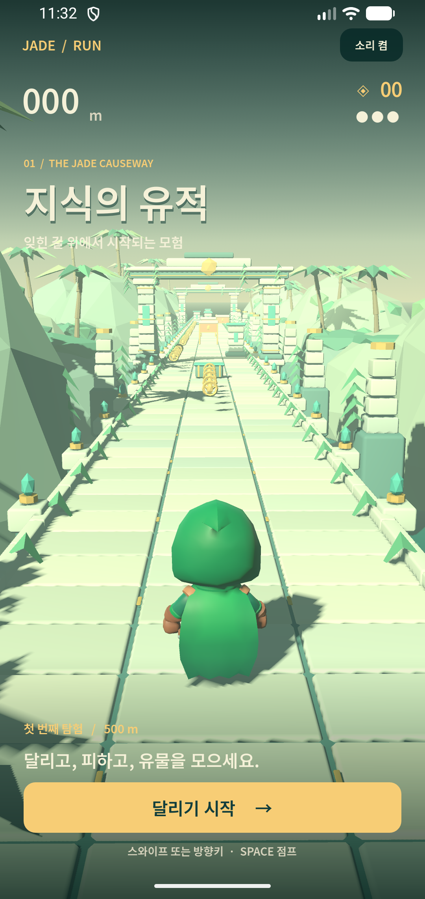

# Jade Run — 지식의 유적

Study Helper의 **게임 화면과 조작감을 검증하기 위한 Godot 4.6.2 3D 시제품**입니다.
500m 길의 유적에서 유물을 모으고 세 종류의 장애물을 피합니다.
Kotlin `studyCore`가 제공한 문제를 50·180·330m에서 표시하고, Kotlin 채점 결과를 받아 해설을 보여줍니다.
[역할 분담·데이터 계약](../docs/STUDY_GAME_CONTRACT.md)과 [iOS 실행](../godotIOS/README.md)을 참고하세요.
기존 Compose 문제 풀이 앱은 별도로 실행합니다.



## 실행

Godot에서 이 폴더의 `project.godot`을 열고 **F6이 아닌 F5**로 메인 씬을 실행합니다.
프로젝트 루트에서 바로 실행할 수도 있습니다.

```sh
/Applications/Godot.app/Contents/MacOS/Godot --path godot-runner
```

Android Studio에서는 `godotAndroid` 실행 구성을 선택합니다. 원래 앱은 `androidApp`입니다.
설치 앱 이름은 **Study Helper**입니다. Kotlin 서재에서 노트를 읽고, **문제 모음 → 문제 파일 가져오기 → 이 문제로 게임 시작**으로 이 게임을 실행합니다. 노트의 프롬프트를 복사해 외부 AI에서 문제 JSON을 만들 수 있습니다. 게임의 ‘학습 홈으로’와 Android 뒤로 가기는 게임을 종료하고 제출한 학습 결과를 홈에 돌려줍니다.
Godot 4.6.2와 Android SDK, JDK가 필요합니다. 다른 환경에서는 `GODOT_BIN`을 지정합니다.

```sh
env JAVA_HOME='/Applications/Android Studio.app/Contents/jbr/Contents/Home' \
  ./gradlew :godotAndroid:assembleDebug
```

APK: `../godotAndroid/build/outputs/apk/debug/godotAndroid-debug.apk`

Android 호스트는 공식 `org.godotengine:godot:4.6.2.stable`을 사용합니다.
Gradle이 Godot 리소스를 import하고 ZIP으로 내보낸 뒤 APK assets에 풉니다.
런타임이 파일 안에서 탐색할 수 있도록 엔진 리소스의 APK 압축을 끕니다.
따로 Godot Android export template를 설치할 필요는 없습니다.

## 조작

| 동작 | 키보드 | 터치 |
|---|---|---|
| 차선 이동 | ← → 또는 A D | 좌우 스와이프 / 하단 버튼 |
| 점프 | Space / ↑ / W | 위로 스와이프 / 점프 버튼 |
| 슬라이드 | ↓ / S | 아래로 스와이프 / 슬라이드 버튼 |
| 일시정지·계속 | Esc / P | 우측 상단 Ⅱ / 계속 달리기 |
| 시작·결과에서 재시작 | Enter / R | 달리기 시작 / 다시 달리기 |

- 청록색 낮은 돌은 점프, 붉은 천은 슬라이드, 높은 기둥은 옆 차선으로 회피합니다.
- 충돌하면 체력 1칸을 잃고 1.6초 동안 추가 피해를 받지 않습니다. 총 3칸입니다.
- 달릴수록 조금씩 빨라지며 500m에 도달하면 완주합니다.
- 일시정지와 앱 백그라운드 전환은 진행과 캐릭터 애니메이션을 멈춥니다.
- 최고 거리와 음소거 설정은 Godot `user://records.cfg`에 저장됩니다.

## 구조와 아트

- `scenes/main.tscn`: 월드, 코스, 캐릭터, 카메라, HUD를 연결하는 메인 씬.
- `scripts/game.gd`: 시작·달리기·일시정지·결과, 입력, 사운드, 효과.
- `scripts/runner.gd`: CharacterBody3D 점프 물리, 차선 보간, 스킨 애니메이션.
- `scripts/course.gd`: 고정 크기 장애물 풀, 재현 가능한 코스, 이동 구간 충돌 판정.
- `scripts/world.gd`: 재사용하는 석조 길·협곡·유적 문, 조명, 물 셰이더.
- `scripts/hud.gd`: 한국어 메뉴·터치 HUD·문제와 해설 표시.
- `scripts/study_bridge.gd`: `StudyTransport`, Kotlin JSON 요청/응답 전송과 데이터 검증.
- `scripts/native_study_probe.gd`: `-- --study-probe`를 전달한 debug 앱에서만 실행하는 네이티브 연결 검증.
- `tools/build_environment.py`: Blender로 만든 오리지널 환경 메시의 재생성 스크립트.
- `tools/build_audio.py`: Python 표준 라이브러리로 만드는 오리지널 효과음.

캐릭터는 KayKit의 CC0 스킨 모델입니다. 단순 도형 캐릭터가 아니라 스켈레톤과
AnimationPlayer를 사용하며, 달리기·점프·웅크리기 자세를 전환합니다.
슬라이드는 현재 앉는 포즈를 보정해 표현합니다. 전용 슬라이드 모션은 추후 다듬을 부분입니다.
자산 출처와 라이선스는 [THIRD_PARTY.md](THIRD_PARTY.md)에 있습니다.

환경 모델은 이미 포함되어 있어 실행 시 Blender가 필요하지 않습니다. 재생성하려면:

```sh
/Applications/Blender.app/Contents/MacOS/Blender --background --factory-startup \
  --python godot-runner/tools/build_environment.py
python3 godot-runner/tools/build_audio.py
```

## 검증

```sh
/Applications/Godot.app/Contents/MacOS/Godot --headless --path godot-runner --editor --import --quit
/Applications/Godot.app/Contents/MacOS/Godot --headless --path godot-runner --script tests/smoke.gd
/Applications/Godot.app/Contents/MacOS/Godot --path godot-runner --script tests/capture.gd
```

`smoke.gd`는 실제 씬과 물리 바디로 차선 경계·점프/착지·중복 입력·슬라이드·충돌·유물 중복 수집·
일시정지/재개·백그라운드 전환·500m 완주·재시작·장애물 풀 크기를 확인합니다.
테스트는 플레이 기록을 저장하지 않습니다. `capture.gd`는 실제 GPU 뷰포트를 `artifacts/`에 저장합니다.

2026-09-27 검증: Godot 4.6.2에서 **32개 자동 검증 통과**, Mac 뷰포트 캡처,
Pixel 4 Android 37 에뮬레이터에서 실행·스와이프 차선 이동과 점프·유물 수집·충돌·일시정지·
백그라운드 복귀 확인. 기존 `androidApp` 빌드도 통과했습니다.
Mac의 OpenGL 실행에서는 일부 바닥 그림자에 미세한 줄무늬가 보입니다. Android 캡처에서는
동일한 현상이 보이지 않았으며, 기기별 그림자 품질 조정은 후속 작업입니다.

새 학습 연결 검증:

```sh
./gradlew :studyCore:jvmTest :studyCore:iosSimulatorArm64Test :studyCore:writeContractFixtures
/Applications/Godot.app/Contents/MacOS/Godot --headless --path godot-runner --script tests/study_smoke.gd
```

Kotlin 생성·채점 테스트는 JVM과 iOS에서 실행합니다. Godot `study_smoke.gd`는 Kotlin이 실제로 생성한 JSON 응답을 읽어 문제 표시·게임 정지·해설·중복 입력·오류 처리를 확인합니다. 플랫폼의 실제 Kotlin 호출은 Android 화면 실행과 iOS 통합 앱의 debug `--notebook-probe`로 별도 검증합니다.

Mac Godot 에디터에서 학습도 실행하려면 다른 터미널에서 `./gradlew :studyCore:runDesktopBridge`를 실행하세요. 다른 OS나 사용자 데이터 경로에서는 `-PbridgeDir=".../study-bridge"`를 지정합니다. 호스트 없이 실행하면 자유 달리기입니다.

Android와 iOS는 Kotlin 노트 서재·마크다운 뷰어·편집·프롬프트 복사·문제 JSON 가져오기·최근 결과 저장을 지원합니다. 앱 내부 AI 생성·전체 복습 이력은 후속 작업입니다. iOS에서도 서재가 기본 화면이며 게임을 선택할 때만 엔진을 초기화합니다. 서재 복귀 후 렌더링을 중단하고 엔진 인스턴스는 재사용합니다. 시뮬레이터 검증은 실제 iPhone의 성능 검증을 대신하지 않습니다.

2026-09-27 앞선 학습 연결 검증: 기존 러너 **32개**, Kotlin JSON과 게임 상태 연결 **16개**, 실제 iOS Kotlin/Native 왕복 **12개** 통과. 이후 노트·문제 파일 검증을 포함한 Kotlin 공통 테스트는 **21개를 JVM/iOS 각각** 통과했습니다. Android 에뮬레이터에서 가져온 사례형 문제 표시·정답 선택·해설·홈 복귀를 직접 확인했습니다.

[Android 문제](artifacts/android-study-question.png) · [Android 해설](artifacts/android-study-feedback.png) · [iOS 문제](artifacts/ios-study-question.png) · [iOS 해설](artifacts/ios-study-feedback.png)

최신 iOS 서재 통합 검증: 실제 iPhone과 시뮬레이터에서 각각 **19개 통과**. [아이폰 보고서](artifacts/iphone-notebook-report.json) · [서재](artifacts/iphone-notebook-library.png).
